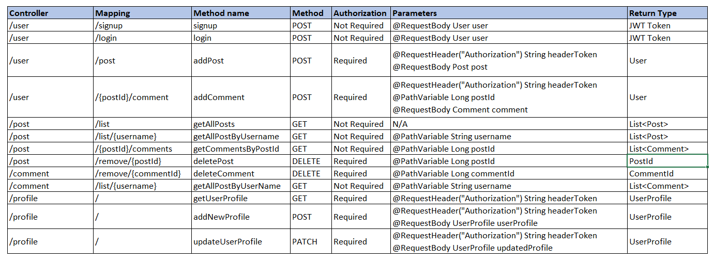

# redditClone Backend

The redditClone backend has been created to allow for users to login, sign up, create/delete posts and comments. 

## Table of Contents
* [Technologies Used](#technologies-used)
* [Dependencies and Installation](#dependencies-and-installation)
* [Project Deliverables and Timeline](#project-deliverables-and-timeline)
* [General Approach](#general-approach)
* [User Stories](#user-stories)
* [ERD](#erd)

## Technologies Used
- Java - utilized Eclipse as the IDE
- Git / GitHub - to host our code for version control and a shared working repository
- Pivotal Tracker - to write user stories and keep track of the technical requirements

## Dependencies and Installation
- Maven
- TomCat
- Spring
- Hibernate
- Postgres
- JUnit
- Mockito

Refer to the pom.xml file.

## User Stories
Link:   https://www.pivotaltracker.com/n/projects/2407513

## Project Deliverables and Timeline
10/21
- User stories
- ERD
- Add dependencies

10/22
- Sign up functionality
- Login functionality
- Profile functionality
- Add security

10/23
- Post functionality (GET/POST/DELETE)
- Comment functionality (GET/POST/DELETE)

10/24
- Integrate backend with frontend application
- Testing

10/25
- Testing


## General Approach

The general approach taken was to work collaboratively to ensure that all project deliverables would be met. We began with the planning phase where we developed a list of endpoints that would need to be created and discussed the best way to structure the relationship between the USER, POST and COMMENT objects and created a deliverables timeline. After generally discussing user stories and utilizing pivotal tracker to allocate and prioritize work, we focused on building the backend within the first few days so that we would have ample time to integrate, create unit tests and troubleshoot any unforeseen errors for the remainder of the project.

A few of the challenges that we encountered and how we resolved those issues:

- Issues relating to the relational mapping of our tables - initially we were setting bidirectional relationships, where the child would be added back to the parent table since we were unaware the Hibernate would automatically handle this for us. This led to many errors where the system would believe that there were duplicate values. 

- Challenges with CORS when integrating the front end with the back end. This was resolved by adding a CorsConfigurationSource to the SecurityConfig file.

- [Testing]

We spent a significant amount of time focused on testing - both writing tests and checking the endpoints to make sure that the functionality was maintained.

## Design Decisions

**API Table**




**ERD / Association Choices**


- **Post to User (Many-to-One Unidirectional)** - A post is dependent on a user to exist and a call to a post requires access to a username to populate the post details on the front-end. A user on the other hand can exist independently from a post and a call to a user does not necessarily require a list of posts. Therefore, a unidirectional approach was taken where a post will have reference to a user.

- **Post to Comment (One-to-Many Bidirectional) -**  A comment is dependent on a post to exist and our front-end requires all comments to be loaded when a post is called. Therefore a bidirectional approach where both sides have a reference to each other

- **Comment to User (Many-to-One Unidirectional) -** A comment is dependent on a user to exist and a call to a comment requires access to a username to populate the comment details on the front-end. A user on the other hand can exist independently from a comment and a call to a user does not necessarily require a list of comments. Therefore, a unidirectional approach was taken where a comment will have reference to a user.

- **User to User Profile (One-to-One Unidirectional) -** A user-profile may only be accessed through a user. Therefore, a one-to-one unidirectional approach was taken where a user will have reference a user-profile.

**Error Handling**
- **Incorrect Login Details** - If a user submits an incorrect username, password, or both an IncorrectLoginException is thrown and handled by the exception handler shown below. The handler will send a 401 unauthorized status along with a JSON object containing a message stating "Incorrect username or password".
```java
public class UserController {
...
	@ExceptionHandler
	public ResponseEntity<ErrorResponse> handleExcption(IncorrectLoginException err){
		ErrorResponse error = new ErrorResponse(HttpStatus.UNAUTHORIZED.value(), err.getMessage());
		return new ResponseEntity<>(error, HttpStatus.UNAUTHORIZED);
	}
...
}
```

## Coverage


We achieved >80% coverage on all areas except the config package.


